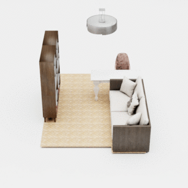
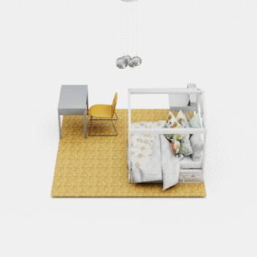

## ATISS: Autoregressive Transformers for Indoor Scene Synthesis
<p>
    
    
    
</p>

This repository contains the code that accompanies our paper [ATISS:
Autoregressive Transformers for Indoor Scene
Synthesis](https://nv-tlabs.github.io/ATISS).

You can find detailed usage instructions for training your own models, using
our pretrained models as well as performing the interactive tasks described in
the paper below.

If you found this work influential or helpful for your research, please consider citing

```
@Inproceedings{Paschalidou2021NEURIPS,
  author = {Despoina Paschalidou and Amlan Kar and Maria Shugrina and Karsten Kreis and Andreas Geiger and Sanja Fidler},
  title = {ATISS: Autoregressive Transformers for Indoor Scene Synthesis},
  booktitle = {Advances in Neural Information Processing Systems (NeurIPS)},
  year = {2021}
}
```

## Installation & Dependencies

Our codebase has the following dependencies:

- [numpy](https://numpy.org/doc/stable/user/install.html)
- [cython](https://cython.readthedocs.io/en/latest/src/quickstart/build.html)
- [pillow](https://pillow.readthedocs.io/en/stable/installation.html)
- [pyyaml](https://pyyaml.org/wiki/PyYAMLDocumentation)
- [pytorch-fast-transformers](https://pypi.org/project/pytorch-fast-transformers/)
- [pyrr](https://pyrr.readthedocs.io/en/latest/index.html)
- [torch && torchvision](https://pytorch.org/get-started/locally/)
- [trimesh](https://github.com/mikedh/trimesh)
- [tqdm](https://github.com/tqdm/tqdm)

For the visualizations, we use [simple-3dviz](http://simple-3dviz.com), which
is our easy-to-use library for visualizing 3D data using Python and ModernGL and
[matplotlib](https://matplotlib.org/) for the colormaps. Note that
[simple-3dviz](http://simple-3dviz.com) provides a lightweight and easy-to-use
scene viewer using [wxpython](https://www.wxpython.org/). If you wish you use
our scripts for visualizing the generated scenes, you will need to also
install [wxpython](https://anaconda.org/anaconda/wxpython). Note that for all
the renderings in the paper we used NVIDIA's
[OMNIVERSE](https://www.nvidia.com/en-us/omniverse/).

The simplest way to make sure that you have all dependencies in place is to use
[conda](https://docs.conda.io/projects/conda/en/4.6.1/index.html). You can
create a conda environment called ```atiss``` using
```
conda env create -f environment.yaml
conda activate atiss
```

Next compile the extension modules. You can do this via
```
python setup.py build_ext --inplace
pip install -e .
```

## Dataset

To evaluate a pretrained model or train a new model from scratch, you need to
obtain the
[3D-FRONT](https://tianchi.aliyun.com/specials/promotion/alibaba-3d-scene-dataset)
and the
[3D-FUTURE](https://www.google.com/search?q=3d-future&oq=3d-fut&aqs=chrome.1.69i57j0j0i30l8.3909j0j7&sourceid=chrome&ie=UTF-8)
dataset. To download both datasets, please refer to the instructions provided in the dataset's
[webpage](https://tianchi.aliyun.com/specials/promotion/alibaba-3d-scene-dataset).
As soon as you have downloaded the 3D-FRONT and the 3D-FUTURE dataset, you are
ready to start the preprocessing. In addition to a preprocessing script
(`preprocess_data.py`), we also provide a very useful script for visualising
3D-FRONT scenes (`render_threedfront_scene.py`), which you can easily execute by running
```
python render_threedfront_scene.py SCENE_ID path_to_output_dir path_to_3d_front_dataset_dir path_to_3d_future_dataset_dir path_to_3d_future_model_info path_to_floor_plan_texture_images
```
You can also visualize the walls, the windows as well as objects with textures
by setting the corresponding arguments. Apart from only visualizing the scene
with scene id `SCENE_ID`, the `render_threedfront_scene.py` script also
generates a subfolder in the output folder, specified via the
`path_to_output_dir` argument that contains the .obj files as well as the
textures of all objects in this scene. Note that examples of the expected scene ids
`SCENE_ID` can be found in the train/test/val split files for the various rooms
in the [config](https://github.com/nv-tlabs/ATISS/tree/master/config) folder,
e.g. MasterBedroom-28057, LivingDiningRoom-4125 etc.


### Data Preprocessing

Once you have downloaded the 3D-FRONT and 3D-FUTURE datasets you need to run
the `preprocess_data.py` script in order to prepare the data to
be able to train your own models or generate new scenes using previously
trained models. To run the preprocessing script simply run
```
python preprocess_data.py path_to_output_dir path_to_3d_front_dataset_dir path_to_3d_future_dataset_dir path_to_3d_future_model_info path_to_floor_plan_texture_images --dataset_filtering threed_front_bedroom
```
Note that you can choose the filtering for the different room types (e.g.
bedrooms, living rooms, dining rooms, libraries) via the `dataset_filtering`
argument. The `path_to_floor_plan_texture_images` is the path to a folder
containing different floor plan textures that are necessary to render the rooms
using a top-down orthographic projection. An example of such a folder can be
found in the `demo\floor_plan_texture_images` folder.

This script starts by parsing all scenes from the 3D-FRONT dataset and then for
each scene it generates a subfolder inside the `path_to_output_dir` that
contains the information for all objects in the scene (`boxes.npz`), the room
mask (`room_mask.png`) and the scene rendered using a top-down
orthographic_projection (`rendered_scene_256.png`). Note that for the case of
the living rooms and dining rooms you also need to change the size of the room
during rendering to 6.2m from 3.1m, which is the default value, via the
`--room_side` argument.

Morover, you will notice that the `preprocess_data.py` script takes a
significant amount of time to parse all 3D-FRONT scenes. To reduce the waiting
time, we cache the parsed scenes and save them to the `/tmp/threed_front.pkl`
file. Therefore, once you parse the 3D-FRONT scenes once you can provide this
path in the environment variable `PATH_TO_SCENES` for the next time you run this script as follows:
```
PATH_TO_SCENES="/tmp/threed_front.pkl" python preprocess_data.py path_to_output_dir path_to_3d_front_dataset_dir path_to_3d_future_dataset_dir path_to_3d_future_model_info path_to_floor_plan_texture_images --dataset_filtering room_type
```

Finally, to further reduce the pre-processing time, note that it is possible to
run this script in multiple threads, as it automatically checks whether a scene
has been preprocessed and if it is it moves forward to the next scene.

### How to pickle the 3D-FUTURE dataset

Most of our scripts require to provide a path to a file that contains the
parsed `ThreedFutureDataset` after being pickled. To do this, we provide the
`pickle_threed_future_dataset.py` that does this automatically for you. You can simply run this script as follows:
```
python pickle_threed_future_dataset.py path_to_output_dir path_to_3d_front_dataset_dir path_to_3d_future_dataset_dir path_to_3d_future_model_info --dataset_filtering room_type
```
Note that by specifying the `PATH_TO_SCENES` environment variable this script
will run significantly faster. Moreover, this step is necessary for all room
types containing different objects. For the case of 3D-FRONT this is for the
bedrooms and the living/dining rooms, thus you have to run this script twice
with different `--dataset_filtering` options. Please check the help menu for
additional details.

## Usage

As soon as you have installed all dependencies and have generated the
preprocessed data, you can now start training new models from scratch, evaluate
our pre-trained models and visualize the generated scenes using one of our
pre-trained models. All scripts expect a path to a config file. In the `config`
folder you can find the configuration files for the different room types. Make
sure to change the `dataset_directory` argument to the path where you saved the
preprocessed data from before.

### Scene Generation

To generate rooms using a previously trained model, we provide the
`generate_scenes.py` script and you can execute it by running
```
python generate_scenes.py path_to_config_yaml path_to_output_dir path_to_3d_future_pickled_data path_to_floor_plan_texture_images --weight_file path_to_weight_file
```
where the argument ``--weight_file`` specifies the path to a trained model and
the argument ``path_to_config_yaml`` defines the path to the config file used
to train that particular model. By default this script randomly selects floor
plans from the test set and conditioned on this floor plan it generate
different arrangements of objects. Note that if you want to generate a scene
conditioned on a specific floor plan, you can select it by providing its
scene id via the `--scene_id` argument. In case you want to run this script
headlessly you should set the `--without_screen` argument. Finally, the
`path_to_3d_future_pickled_data` specifies the path that contains the parsed
`ThreedFutureDataset` after being pickled.

### Scene Completion && Object Placement

To perform scene completion, we provide the `scene_completion.py` script that
can be executed by running
```
python scene_completion.py path_to_config_yaml path_to_output_dir path_to_3d_future_pickled_data path_to_floor_plan_texture_images --weight_file path_to_weight_file
```
where the argument ``--weight_file`` specifies the path to a trained model and
the argument ``path_to_config_yaml`` defines the path to the config file used
to train that particular model. For this script make sure that the `encoding
type` in the config file has also the word `eval` in it.
By default this script randomly selects a room from the test set and
conditioned on this partial scene it populates the empty space with objects.
However, you can choose a specific room via the `--scene_id` argument.
This script can be also used to perform object placement. Namely starting from
a partial scene add an object of a specific object category.

In the output directory, the `scene_completion.py` script generates two folders
for each completion, one that contains the mesh files of the initial partial
scene and another one that contains the mesh files of the completed scene.

### Object Suggestions

We also provide a script that performs object suggestions based on a
user-specified region of acceptable positions. Similar to the previous scripts
you can execute by running
```
python object_suggestion.py path_to_config_yaml path_to_output_dir path_to_3d_future_pickled_data path_to_floor_plan_texture_images --weight_file path_to_weight_file
```
where the argument ``--weight_file`` specifies the path to a trained model and
the argument ``path_to_config_yaml`` defines the path to the config file used
to train that particular model. Also for this script, please make sure that the
`encoding type` in the config file has also the word `eval` in it.  By default
this script randomly selects a room from the test set and the user can either
choose to remove some objects or keep it unchanged. Subsequently, the user
needs to specify the acceptable positions to place an object using 6 comma
seperated numbers that define the bounding box of the valid positions.
Similar to the previous scripts, it is possible to select a particular scene by 
choosing specific room via the `--scene_id` argument.

In the output directory, the `object_suggestion.py` script generates two folders
in each run, one that contains the mesh files of the initial
scene and another one that contains the mesh files of the completed scene with
the suggested object.

### Failure Cases Detection and Correction

We also provide a script that performs failure cases correction on a scene that
contains a problematic object. You can simply execute it by running
```
python failure_correction.py path_to_config_yaml path_to_output_dir path_to_3d_future_pickled_data path_to_floor_plan_texture_images --weight_file path_to_weight_file
```
where the argument ``--weight_file`` specifies the path to a trained model and
the argument ``path_to_config_yaml`` defines the path to the config file used
to train that particular model. Also for this script, please make sure that the
`encoding type` in the config file has also the word `eval` in it.  By default
this script randomly selects a room from the test set and the user needs to
select an object inside the room that will be located in an unnatural position.
Given the scene with the unnatural position, our model identifies the
problematic object and repositions it in a more plausible position.

In the output directory, the `falure_correction.py` script generates two folders
in each run, one that contains the mesh files of the initial
scene with the problematic object and another one that contains the mesh files
of the new scene.

### Training

Finally, to train a new network from scratch, we provide the
``train_network.py`` script. To execute this script, you need to specify the
path to the configuration file you wish to use and the path to the output
directory, where the trained models and the training statistics will be saved.
Namely, to train a new model from scratch, you simply need to run
```
python train_network.py path_to_config_yaml path_to_output_dir
```
Note that it is also possible to start from a previously trained model by
specifying the ``--weight_file`` argument, which should contain the path to a
previously trained model. 

Note that, if you want to use the RAdam optimizer during training, you will have
to also install to download and install the corresponding code from [this
repository](https://github.com/LiyuanLucasLiu/RAdam).

We also provide the option to log the experiment's evolution using [Weights &
Biases](https://wandb.ai/site). To do that, you simply need to set the
`--with_wandb_logger` argument and of course to have installed
[wandb](https://pypi.org/project/wandb/) in your conda environment.

## Relevant Research

Please also check out the following papers that explore similar ideas:
- Fast and Flexible Indoor Scene Synthesis via Deep Convolutional Generative Models [pdf](https://arxiv.org/pdf/1811.12463.pdf)
- Sceneformer: Indoor Scene Generation with Transformers [pdf](https://arxiv.org/pdf/2012.09793.pdf)
