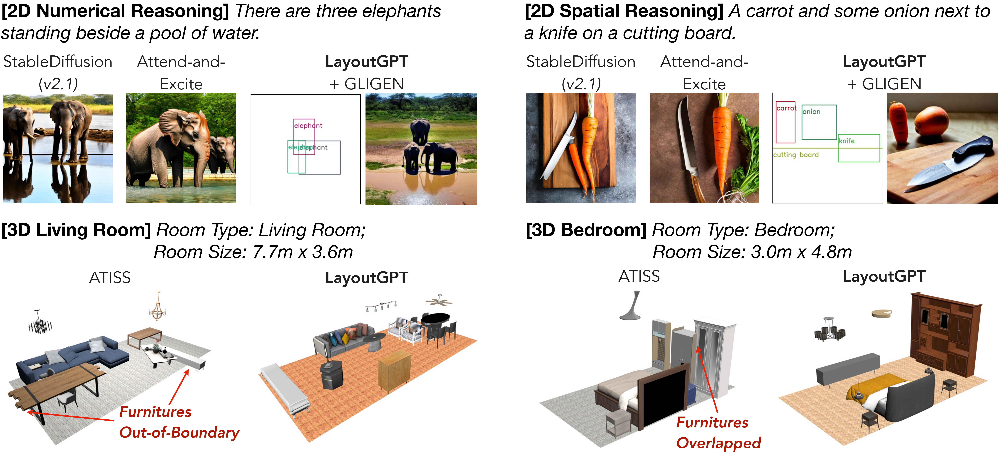
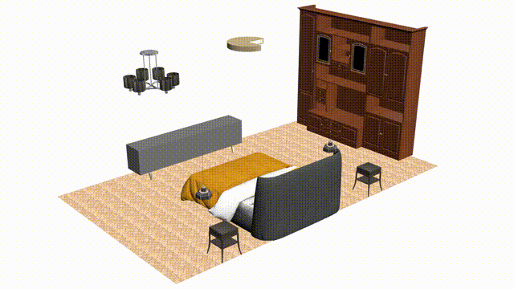
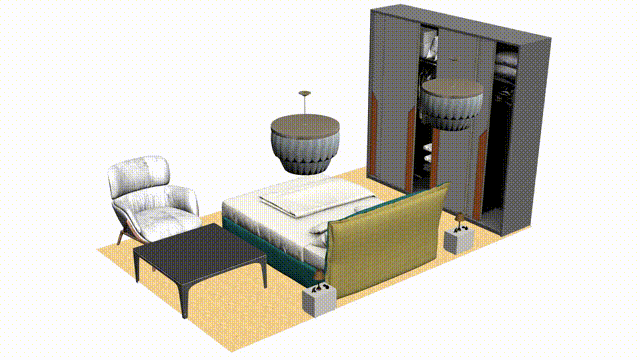
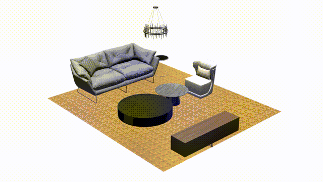
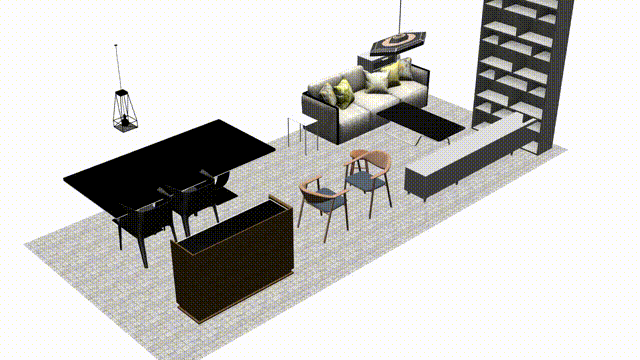

# [NeurIPS 2023] LayoutGPT: Compositional Visual Planning and Generation with Large Language Models


[Weixi Feng](https://weixi-feng.github.io/)<sup>1*</sup>,
[Wanrong Zhu](https://wanrong-zhu.com/)<sup>1*</sup>,
[Tsu-Jui Fu](https://tsujuifu.github.io/)<sup>1</sup>,
[Varun Jampani](https://varunjampani.github.io/)<sup>3</sup>,
[Arjun Akula](https://www.arjunakula.com/)<sup>3</sup>,
[Xuehai He](https://scholar.google.com/citations?user=kDzxOzUAAAAJ&)<sup>2</sup>,
[Sugato Basu](https://sites.google.com/site/sugatobasu/)<sup>3</sup>,
[Xin Eric Wang](https://eric-xw.github.io/)<sup>2</sup>,
[William Yang Wang](https://sites.cs.ucsb.edu/~william/)<sup>1</sup>
<br>
<sup>1</sup>UC Santa Barbara, <sup>2</sup>UC Santa Cruz, <sup>3</sup>Google
<br>
<sup>*</sup>Equal Contribution
<br>

[Project Page](https://layoutgpt.github.io/) | [arxiv](https://arxiv.org/abs/2305.15393)



<p style="text-align: center;">
    
    
    
    <!--  -->
</p>

## Updates

2023.10.10 We released our preprocessed 3D-FRONT and 3D-FUTURE data (see below). Updated installation and preparation guidance. 

2023.09.22 LayoutGPT is accepted to NeurIPS 2023!


## Installation & Dependencies
LayoutGPT and the downstream generation requires different libraries. You can install everything all at once
```
conda env create -f environment.yml
```
and additionally
```
# for GLIGEN
wget https://huggingface.co/gligen/gligen-generation-text-box/resolve/main/diffusion_pytorch_model.bin -O gligen/gligen_checkpoints/checkpoint_generation_text.pth

# for image evaluation using GLIP
cd eval_models/GLIP
python setup.py build develop --user
wget https://github.com/SwinTransformer/storage/releases/download/v1.0.0/swin_large_patch4_window12_384_22k.pth -O MODEL/swin_large_patch4_window12_384_22k.pth
wget https://huggingface.co/GLIPModel/GLIP/blob/main/glip_large_model.pth -O MODEL/glip_large_model.pth

# for scene synthesis
cd ATISS
python setup.py build_ext --inplace
pip install -e .
```
You can also refer to the official repo of [GLIGEN](https://github.com/gligen/GLIGEN/tree/master), [GLIP](https://github.com/microsoft/GLIP) and [ATISS](https://github.com/nv-tlabs/ATISS/tree/master) for detailed guidance.

## Data Preparation

### 2D image layouts
Our image layout benchmark NSR-1K and the 3D scene data split is provided under ```./dataset```. NSR-1K contains ground truth image layouts for each prompt extracted from the MSCOCO dataset. Download the [visual features](https://drive.google.com/file/d/11ypmlZW9CAepdkgDHfuVlCqbXGut0XsP/view?usp=sharing) of the train split for counting prompts and put it under ```./dataset/NSR-1K/counting/```

### 3D scene layouts
For indoor scene synthesis, we are able to provide our [preprocessed dataset](https://drive.google.com/file/d/1NV3pmRpWcehPO5iKJPmShsRp_lNbxJuK/view?usp=sharing) after checking the licenses of [3D-FRONT](https://tianchi.aliyun.com/dataset/65347) and [3D-FUTURE](https://tianchi.aliyun.com/dataset/98063). Unzip the downloaded file to ```./ATISS/``` and you should have ```./ATISS/data_output``` and ```./ATISS/data_output_future```.

<!-- you need to additionally prepare the [3D-FRONT](https://tianchi.aliyun.com/specials/promotion/alibaba-3d-scene-dataset) and [3D-FUTURE](https://tianchi.aliyun.com/specials/promotion/alibaba-3d-future) datasets.  -->

You can also refer to [ATISS](https://github.com/nv-tlabs/ATISS/tree/master#dataset) if you prefer to go through the preprocessing steps on your own.

<!-- or follow the steps below:

1. Download and unzip 3D-FRONT.zip and 3D-FUTURE-model.zip
2. Preprocess the scenes to generate ground truth views
```
cd ATISS/scripts
# bedroom as an example, default top-down view
python preprocess_data.py path_to_output_dir path_to_3d_front_dataset_dir path_to_3d_future_dataset_dir path_to_3d_future_model_info ../demo/floor_00003.jpg --dataset_filtering threed_front_bedroom
```
Note that for FID evaluation, we render scene images from four different camera angles. The arguments for the other three angles are: ```--up_vector 0,1,0 --camera_position {2,2,0 or 0,2,2 or 2,2,2}```. For livingroom, remember to set ```--room_side 6.2``` and change ```--dataset_filtering``` accordingly.

3. pickle the furniture data for visualization
```
python pickle_threed_future_dataset.py path_to_pickle_output_dir path_to_3d_front_dataset_dir path_to_3d_future_dataset_dir path_to_3d_future_model_info --dataset_filtering threed_front_bedroom
``` -->


## 2D Image Layout Generation
We provide the script to generate layouts for NSR-1K benchmark. First set up your openai authentication in the script. Then run
```
python run_layoutgpt_2d.py --icl_type k-similar --K 8 --setting counting --gpt_type gpt4 --n_iter 5
```
The generated layout will be saved to ```./llm_output/counting``` by default. To generate images based on the layouts, run
```
cd gligen
python gligen_layout_counting.py --file ../llm_output/counting/gpt4.counting.k-similar.k_8.px_64.json --batch_size 5
```
Note that the script will save a clean image and an image with bounding boxes for each prompt into two separate folders. In our experiment in the preprint, we generate 5 different layouts for each prompt to reduce variance. 

### Layout & Image Evaluation
To evaluate the raw layouts, run
```
# for numerical prompts
python eval_counting_layout.py --file ../llm_output/counting/gpt4.counting.k-similar.k_8.px_64.json
```
To evaluate the generated images using GLIP, run
```
cd eval_models/GLIP
python eval_counting.py --dir path_to_generated_clean_images
```


## 3D Indoor Scene Synthesis
First set up your openai authentication in the script, then run the script to generate scenes
```
python run_layoutgpt_3d.py --dataset_dir ./ATISS/data_output --icl_type k-similar --K 8 --room bedroom --gpt_type gpt4 --unit px --normalize --regular_floor_plan
```
To evaluate the out-of-bound rate (OOB) and KL divergence (KL-div.) of the generated layouts, run
```
python eval_scene_layout.py --dataset_dir ./ATISS/data_output --file ./llm_output/3D/gpt4.bedroom.k-similar.k_8.px_regular.json --room bedroom
```
### Visualization
Following ATISS, you can visualize the generated layout by rendering the scene images using [simple-3dviz](https://simple-3dviz.com/)
```
cd ATISS/scripts
python render_from_files.py ../config/bedrooms_eval_config.yaml visuslization_output_dir ../data_output_future ../demo/floor_plan_texture_images ../../llm_output/3D/gpt4.bedroom.k-similar.k_8.px_regular.json --up_vector 0,1,0 --camera_position 2,2,2 --split test_regular --export_scene
```
To render just the image of particular scene(s), add ```--scene_id id1 id2```. For all visualization shown in the preprint, we use [Blender](https://www.blender.org/) to manually render the scene images. With ```--export_scene```, you can find a folder under ```visuslization_output_dir```  for each scene, which contains ```*.obj``` and ```*.mtl``` files. You can import these files into Blender and render the scenes. While this can be done with Python, we do not have a script to achieve it yet.  


## Citation
Please consider citing our work if you find it relevant or helpful:
```
@article{feng2023layoutgpt,
  title={LayoutGPT: Compositional Visual Planning and Generation with Large Language Models},
  author={Feng, Weixi and Zhu, Wanrong and Fu, Tsu-jui and Jampani, Varun and Akula, Arjun and He, Xuehai and Basu, Sugato and Wang, Xin Eric and Wang, William Yang},
  journal={arXiv preprint arXiv:2305.15393},
  year={2023}
}
```

## Disclaimer
We thank the authors of [GLIGEN](https://github.com/gligen/GLIGEN/tree/master), [GLIP](https://github.com/microsoft/GLIP) and [ATISS](https://github.com/nv-tlabs/ATISS/tree/master) for making their code available. It is important to note that the code present here is not the official or original code of the respective individual or organization who initially created it. Part of the code may be subject to retraction upon official requests. Any use of downstream generation code should be governed by the official terms and conditions set by the original authors or organizations. It is your responsibility to comply with these terms and conditions and ensure that your usage adheres to the appropriate guidelines.